<div align="center">
  <a name="readme-top"></a>
  <a href="https://feiyue.cloud" target="_blank"></a>
  
## 飞越云 | 最新免费好用的企业级 VPN 和组网工具，可私有化部署的 Tailscale平替
</div>
<br/>
 
## 产品简介
 飞越云零信任网络产品提供企业级 VPN 和组网功能，是可免费私有化部署的Tailscale平替 。它基于WireGuard协议启用加密的点对点连接，可让您在世界任何地方安全轻松地访问您被授权的任何设备和应用服务。
 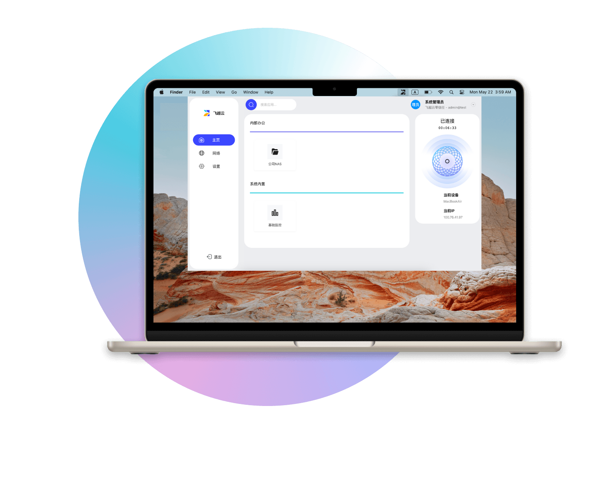

## 飞越云零信任网络

飞越云采用了一种软件定义的网络虚拟化技术，我们称之为构建了一张「虚拟逻辑网络」，将企业在各地分散的数字资产（所有数字化设备、数字身份、数字化服务）重新组织到一张全网状逻辑网络中，以业务为中心生成一张张逻辑组网。
该技术方案使得企业的内网能够突破物理网络的限制，应用了零信任安全理念，实现了真正意义的软件定义网络和应用边界，将分布在多个云、多个数据中心的数字化服务，以及分布在互联网任意位置的数字化设备和数字身份都整合到一个全新的 Mesh 网络中，将碎片化的网络管理、运维管理、安全管理调整为集中统一的中心化管理。

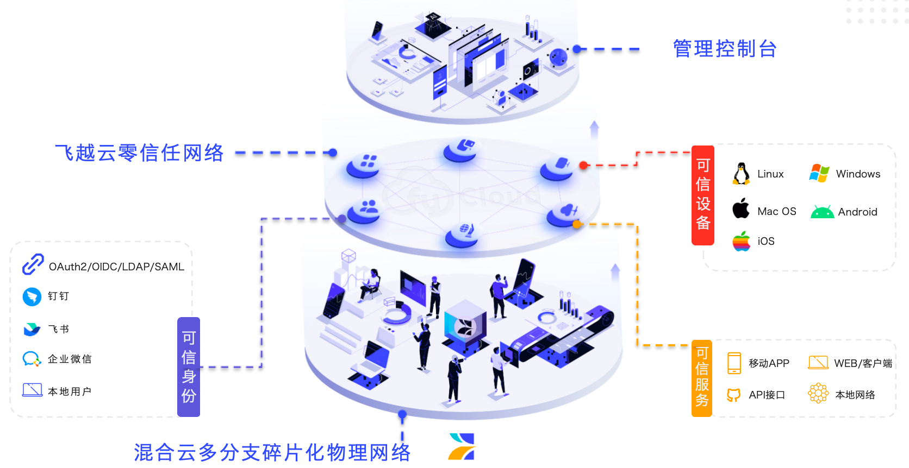

### 飞越云零信任网络免费版 ALL-IN-ONE 单节点部署架构示意图

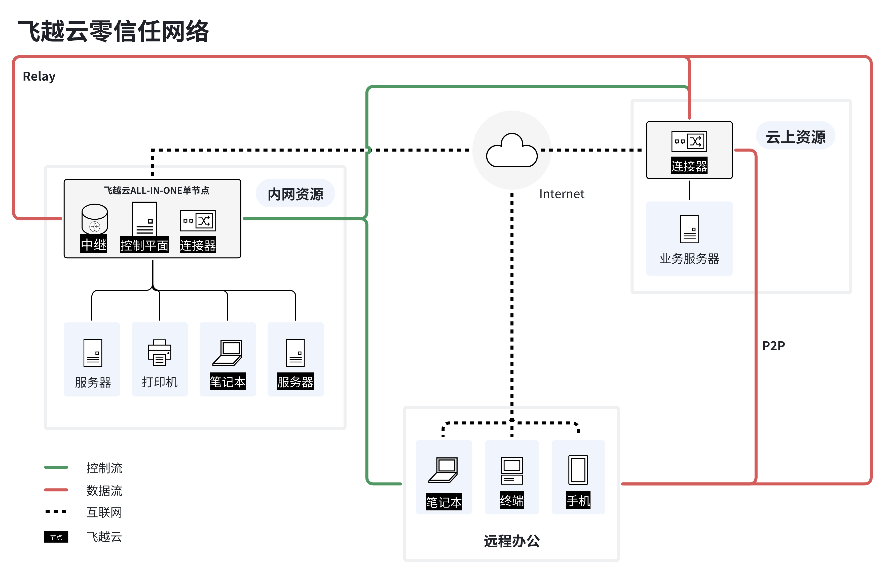

### 飞越云零信任网络标准版的典型部署架构示意图

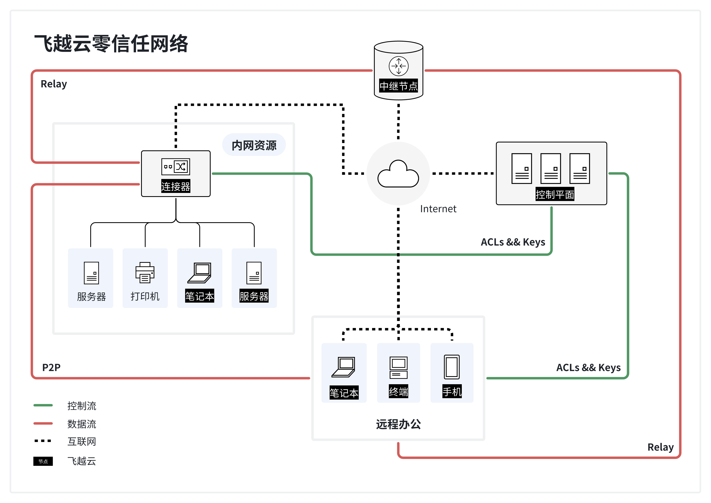

### 飞越云零信任网络多节点高可用集群架构的智能路由示意图

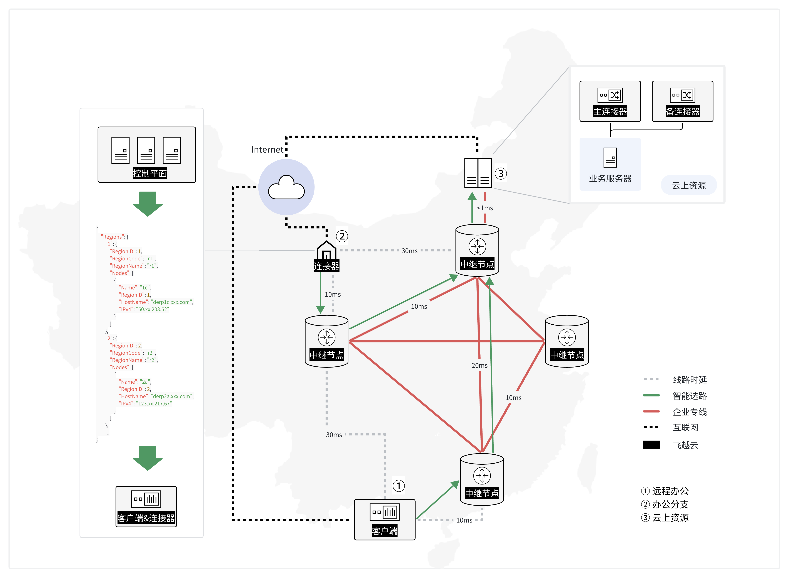

## 快速开始

### 1. 安装包获取

#### x86_64 架构（Linux）

```bash
wget https://dl.flylayer.com/flylayer-offline-linux-amd64-v20250513073928.tar.gz
```

#### ARM64 架构（Linux）

```bash
wget https://dl.flylayer.com/flylayer-offline-linux-arm64-v20250513073928.tar.gz
```

### 2. 执行安装

```bash
# 解压安装包
tar -zxvf <安装包名称>

# 进入安装目录
cd flylayer

# 开始安装
./flylayer-k8s install
```

根据安装引导完成部署。

[查看详细部署文档](https://docs.flylayer.com/deploy/quickstart?from=2)

### 3. 执行卸载

```bash
./flylayer-k8s uninstall
```

---

## 如何选择接入部署方式

### 1. 纯内网方式介绍

部署于完全封闭的内网中，无需公网 IP 或域名。

#### 特点：

- 所有服务监听本地
- 不依赖公网资源

#### 适用场景：

- 机房、政务、办公内网等
- 安全要求高，使用零信任实现内网隔离

#### 安装提示：

- 会自动检测网卡信息，可自定义监听端口（默认：30080/30081/30082）

### 2. 域名方式 (HTTP) 介绍

入口使用域名，通信协议为 HTTP（不加密）。

#### 要求：

- 控制台：http://console.example.com
- 接入地址：http://control.example.com
- 中继地址：http://relay.example.com

#### 特点：

- 所有入口为合法域名，不支持 IP
- 不启用 SSL 加密，部署简单

#### 注意事项：

- 仅适合测试、内网使用，不推荐生产使用

### 3. 域名方式 (HTTPS) 介绍

入口使用域名，通信协议为 HTTPS（加密）。

#### 要求：

- 控制台：https://console.example.com
- 接入地址：https://control.example.com
- 中继地址：https://relay.example.com

#### 特点：

- 所有服务使用合法域名
- 启用 SSL/TLS，通信加密，安全性高

#### 证书要求：

- 每个域名服务提供 `.crt` 和 `.key` 文件
- 可来自公共 CA、自建 CA 或临时自签名证书

#### 推荐用途：

- 生产环境首选
- 有安全、加密、兼容性需求的部署

### 4. 标准方式介绍

灵活配置的接入方式，支持 IP、域名访问，支持 HTTP 或 HTTPS。

#### 特点：

- 支持公网/局域网 IP、域名混用
- 支持 HTTP 或 HTTPS 通信
- 平台引导配置访问地址与 SSL 证书路径

#### 适用场景：

- 对接入方式有自定义需求的技术用户
- 运维经验丰富的团队

## 截图

<table style="border-collapse: collapse; border: 1px solid black;">
  <tr>
    <td style="padding: 5px;background-color:#282828;">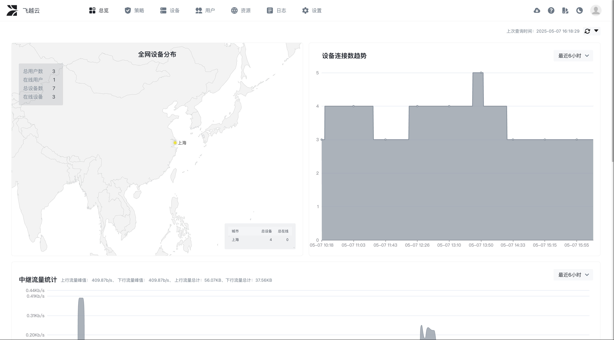</td>
    <td style="padding: 5px;background-color:#282828;">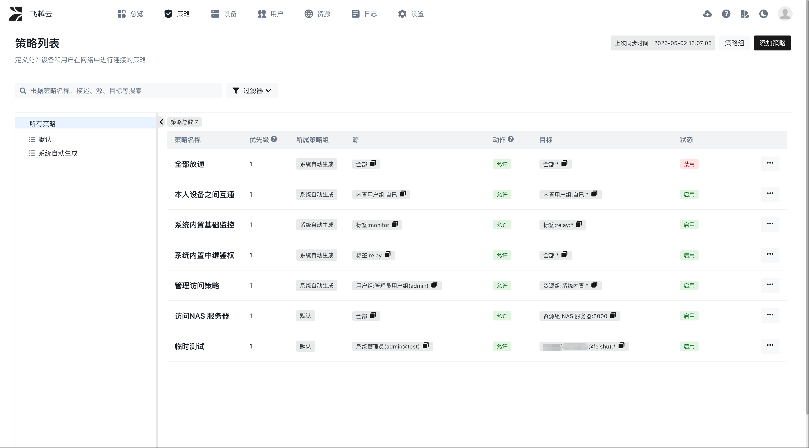</td>    
  </tr>

   <tr>
    <td style="padding: 5px;background-color:#282828;">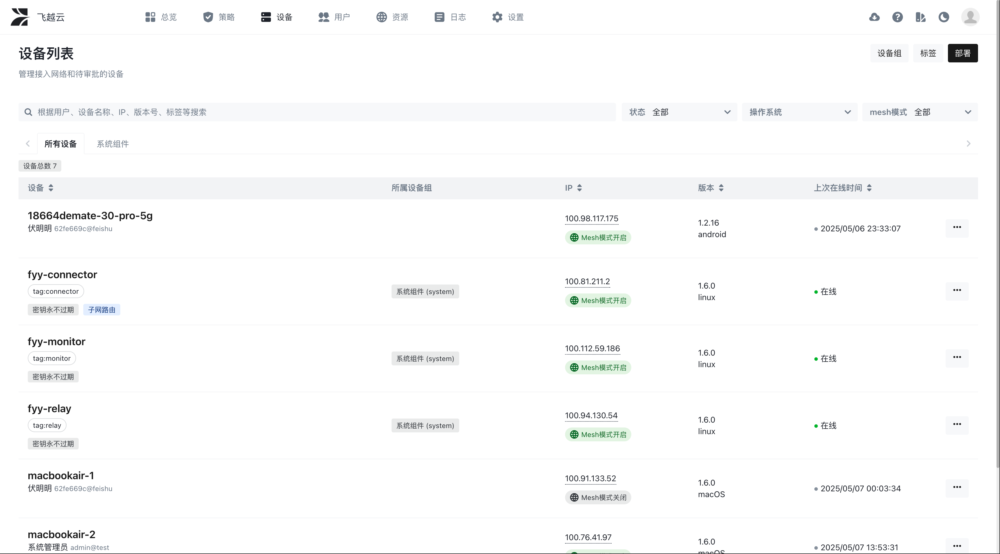</td>
    <td style="padding: 5px;background-color:#282828;">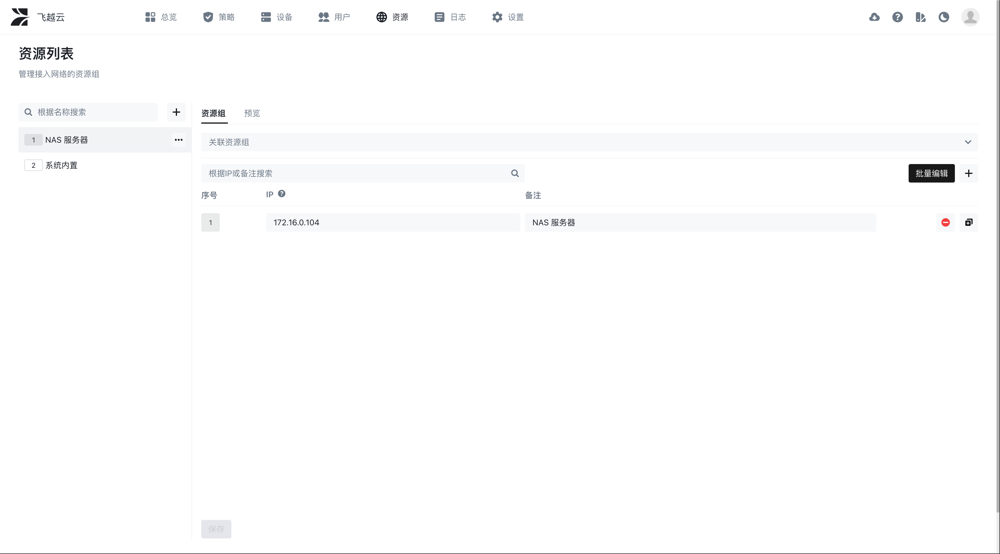</td>    
  </tr>

   <tr>
    <td style="padding: 5px;background-color:#282828;">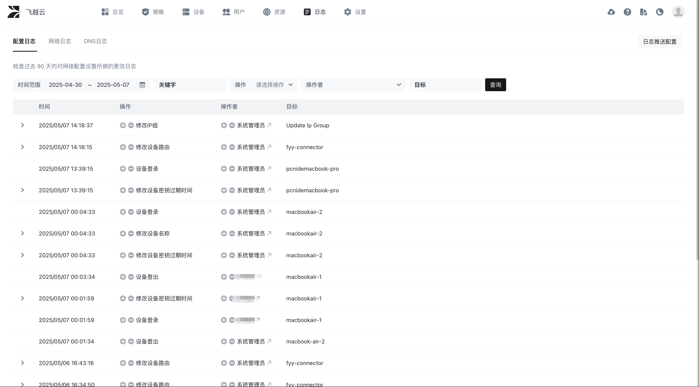</td>
    <td style="padding: 5px;background-color:#282828;">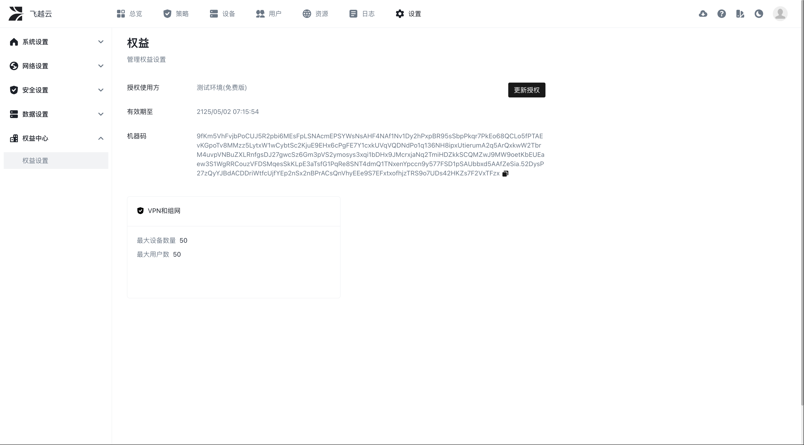</td>    
  </tr>

  <tr>
    <td style="padding: 5px;background-color:#282828;">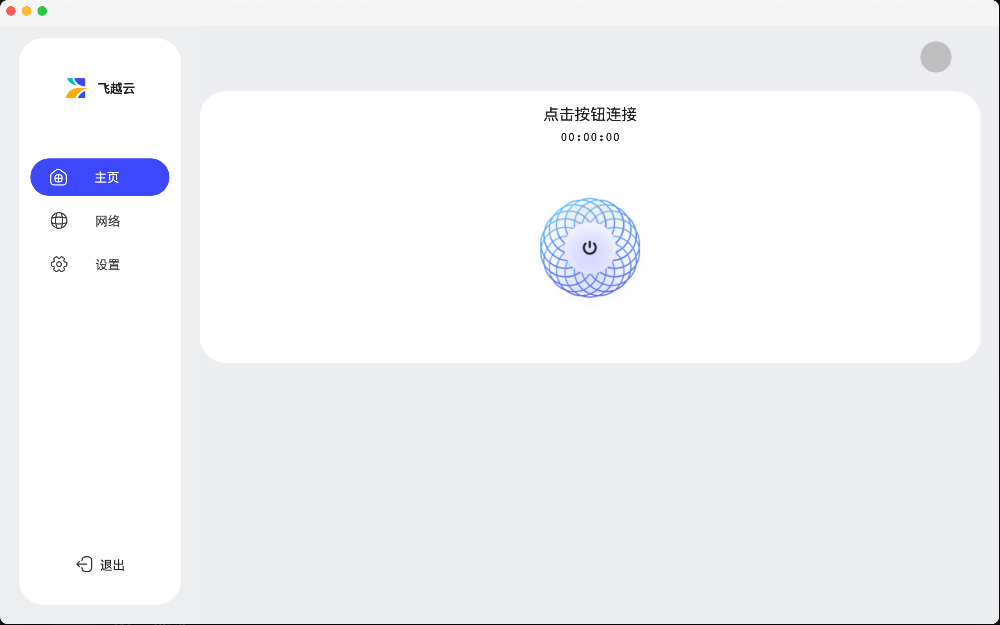</td> 
    <td style="padding: 5px;background-color:#282828;">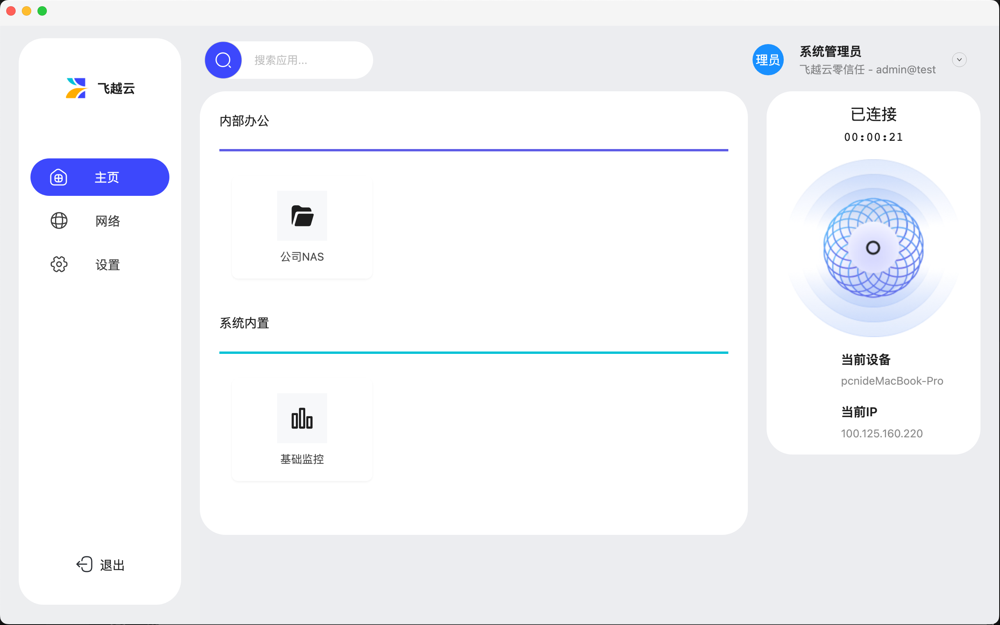</td>
  </tr>

</table>

## 常见问题解答（FAQ）

### 飞越云零信任网络会开源并提供社区版吗？

感谢成熟的开源社区，飞越云零信任网络产品使用了多个协议友好的优质开源项目。因此将会根据实际情况，有计划地进行开源并推出社区版。希望大家能更多地支持和宣传飞越云，飞越云发展地越好将会有更多的资源投入开源项目并回馈社区，目前仅提供免费版下载。

### 飞越云零信任网络和 Tailscale 是什么关系？

可以简单理解为飞越云零信任网络是 Tailscale 的私有化部署版本，但在使用和功能上有一定的差异化，特别是在策略、身份集成、动态组、七层网关、日志、DNS、企业级高可用及性能优化、符合国内使用习惯的终端环境的适配和兼容等功能方面做了大量创新和优化。感谢 Tailscale 具有远见的创新设计以及部分项目的开源，飞越云在Tailscale 的基础之上，针对本土化使用习惯、高安全性需求、中大型组织的企业级需求特别是高可用和管理需求进行了大量优化和创新设计及研发，同时提供了简单方便的私有化部署、配置和升级的全套解决方案。

### 飞越云零信任网络和 Headscale 是什么关系？

没有太大的关系。可以简单理解为Headscale 为 Tailscale 管理控制平面后端的单机版开源实现，使用起来还需要搭配 Tailscale 的官方客户端软件、开源第三方的管理控制平面的前端项目才可以正常使用，适合个人技术爱好者深度研究配置使用。而飞越云零信任网络就是整个 Tailscale 的私有化部署版本，基础功能相似，但企业级特性及部分功能差异化较大，适合各类规模的企业使用。

### 飞越云零信任网络和传统 VPN 产品有什么差别？

飞越云零信任网络是一款深度融合 VPN、各种组网类型和零信任身份的企业级产品，在便捷性、灵活性、功能性、安全性以及企业级管理等方面均具有显著差异。详细对比参考 [竞品对比分析 VPN 部分](https://docs.feiyue.cloud/std/admin-manual/v1/QhuXd9YkmoCEPsxM7FXccn5EnAd#share-TMYndD9iJoYE52xUSFFccq77nzh?from=2)。

### 飞越云零信任网络和其它零信任产品（如 SDP、ZTNA）有什么差别？

飞越云零信任网络产品聚焦于提供默认安全且便捷好用的 IT 网络基础设施，致力于成为一款好用的企业级 VPN 和组网工具，深度融合安全和网络以提供互操作能力。不提供其它零信任产品包含的终端安全一体化的安全功能，如杀毒、 DLP 、沙箱、桌管等。详细对比参考 [竞品对比分析其它零信任产品部分](https://docs.feiyue.cloud/std/admin-manual/v1/QhuXd9YkmoCEPsxM7FXccn5EnAd#share-ZgUgdGpagoxfBdxV5HCc4LFinfb?from=2)。
